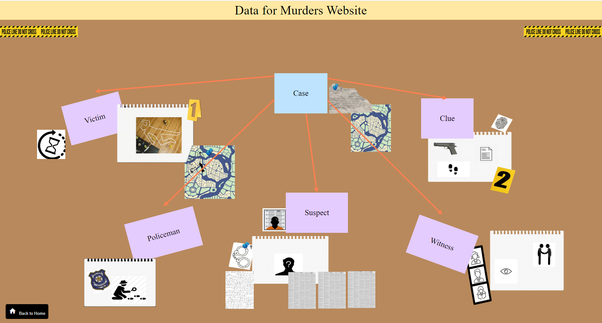
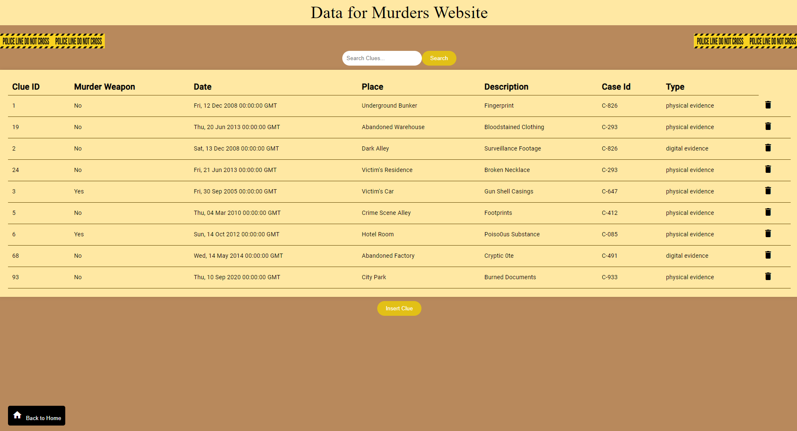
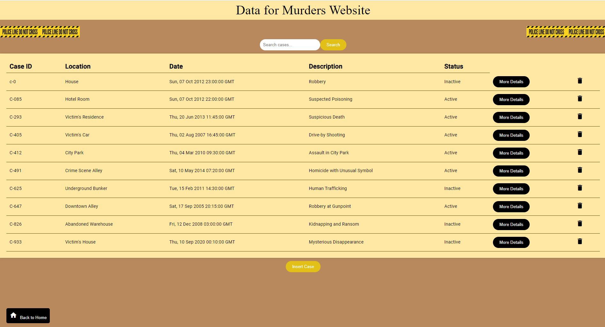

# Data for Murders Website

This repository holds the backend and frontend of the Data for Murders Website which is based on the Data for Murders Database.
- The Database is created in **MySQL**
- The Backend is written in **Python** using **Flask** as the backend framework.
- The Angular Framework is used for the Frontend of the Website

## Prerequisites

Before you begin, ensure you have the following prerequisites installed:

- [Node.js](https://nodejs.org/): Make sure to install Node.js, which includes npm (Node Package Manager).
- [Angular](https://angular.io/): Install Angular CLI globally by running `npm install -g @angular/cli`.
- [Python](https://www.python.org/): Required for the backend server (`database-angular.py`).
- [Flask](https://flask.palletsprojects.com/): The backend is built using Flask, a Python web framework. Install Flask by running `pip install Flask`.


## Running the Web App

1. Open a terminal and run the following command to start the Python server:

   ```bash
   python backend-server.py
   ```

   The backend server will be running at http://127.0.0.1:5000

2. Open another terminal in the project directory and install the dependencies:
    ```bash
   npm install

3. After the dependencies are installed, start the Angular development server:
    ```bash
   npm start
   ```

   This will build the app and start a development server. You can access the web app by navigating to http://localhost:4200/ in your web browser.


## Description 

### Main Page 

In the main page of the Website there are 6 buttons for the 6 main entities of the Data for Murders Database (Case, Suspect, Witness, Clue, Policeman and Victim). When each of the buttons gets clicked it navigates the user to a page displaying information regarding the respective entity. 



### Entities Pages 

In the entities pages the user can see all the information (columns) for the existing elements of the entities (through a GET request).  

Also, the user can delete an existing element by cicking the delete button at the right side of each element (through a DELETE request).

Furthermore, the user can search for a specific element by typing the some characters of the id of the element.

Finally, the user can add an extra element by clicking the `Insert` button at the bottom of the page and filling the respective fields (through POST request).




There is also a `Back to Home` button at the bottom left of the page that navigates to the main page. 


### Case Page

Specifically in the `/cases` page the user can also see the related information for a specific case regarding the people involved and the clues by clicking the `More Details` button at the right side of each case (through GET request).

